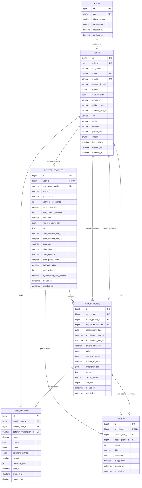

# Hospital Appointment Platform ER Diagram

This ER diagram reflects the current MySQL/Prisma schema used by the hospital appointment booking platform.

## Key Relationship Notes

- `roles -> users` is `1:N`
- `users -> doctor_profiles` is `1:0..1`
- `users (patient) -> appointments` is `1:N`
- `users (staff/reception/admin) -> appointments.booked_by_user_id` is `1:N`, optional
- `doctor_profiles -> appointments` is `1:N`
- `appointments -> transactions` is `1:N`
- `appointments -> reviews` is `1:0..1`
- `doctor_profiles -> reviews` is `1:N`

## Important Constraints

- `users.email` and `users.phone` are unique
- `doctor_profiles.user_id` is unique, so one user can own only one doctor profile
- `doctor_profiles.registration_number` is unique
- `reviews.appointment_id` is unique, so one appointment can have at most one review
- `appointments` uses the unique key `doctor_profile_id + appointment_start_at + slot_lock`
  to block double-booking for active slots

## Performance Indexes

- `users(role_id, status)`
- `doctor_profiles(specialty, is_accepting_new_patients)`
- `doctor_profiles(consultation_fee)`
- `appointments(doctor_profile_id, status, appointment_start_at)`
- `appointments(patient_user_id, status, appointment_start_at)`
- `appointments(appointment_date)`
- `transactions(appointment_id, status, created_at)`
- `transactions(patient_user_id, created_at)`
- `reviews(doctor_profile_id, is_approved, created_at)`
- `reviews(patient_user_id, created_at)`
